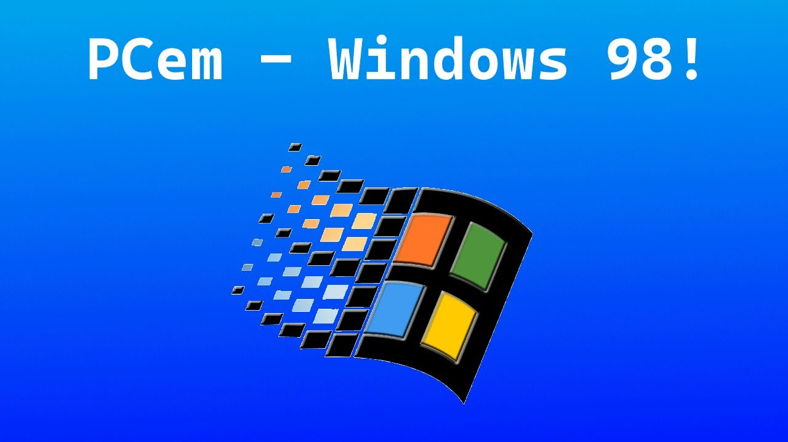

# PC (PCem)

### Description

PCem (short for PC Emulator) is a hypervisor and IBM PC emulator that specializes in running old operating systems and software.

Originally developed as an IBM PC XT emulator, it later emulates other IBM PC compatible computers as well.

### License

GPLv2

### Icon

### Fanart

### Screenshots

Help make me screenshots!
